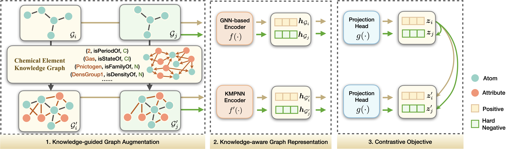

[](https://github.com/Fangyin1994/KCL/blob/main/LICENSE)
[](https://arxiv.org/abs/2112.00544)

<!-- [**中文**](https://github.com/ZJU-Fangyin/KCL/blob/main/README_CN.md) | [**English**](https://github.com/ZJU-Fangyin/KCL)      -->

<!-- 
<p align="center">
    <a href="https://github.com/zjunlp/openue"> </a>
</p> -->

# Molecular Contrastive Learning with Chemical Element Knowledge Graph

This repository is the official implementation of [**KCL**](https://github.com/ZJU-Fangyin/KCL), which is model proposed in a paper: **[Molecular Contrastive Learning with Chemical Element Knowledge Graph](https://arxiv.org/abs/2112.00544)**, accepted by **AAAI 2022** main conference. 

<!-- 
# Contributor
Yin Fang, Qiang Zhang, Haihong Yang, Xiang Zhuang, Shumin Deng, Wen Zhang, Ming Qin, Zhuo Chen, Xiaohui Fan, Huajun Chen -->


# Brief Introduction
We construct a Chemical Element Knowledge Graph (KG) to summarize microscopic associations between elements and propose a novel **K**nowledge-enhanced **C**ontrastive **L**earning (**KCL**) framework for molecular representation learning. 


## Model
We construct a Chemical Element Knowledge Graph (KG) to summarize microscopic associations between elements and propose a novel Knowledge-enhanced Contrastive Learning (KCL) framework for molecular representation learning. KCL framework consists of three modules. **The first module**, knowledge-guided graph augmentation, augments the original molecular graph based on the Chemical Element KG. **The second module**, knowledge-aware graph representation, extracts molecular representations with a common graph encoder for the original molecular graph and a Knowledge-aware Message Passing Neural Network (KMPNN) to encode complex information in the augmented molecular graph. **The final module** is a contrastive objective, where we maximize agreement between these two views of molecular graphs.

<div align=center>
</div>


# Requirements
To run our code, please install dependency packages.
```
python         3.7
torch          1.7.1
dgl            0.6.1
rdkit          2018.09.3
dgllife        0.2.8
pandarallel    1.5.2
numpy          1.20.3
pandas         1.3.1
lmdb           1.2.1
```

# Preparing

### Pre-training data
We collect 250K unlabeled molecules sampled from the ZINC 15 datasets to pre-train KCL. The raw pre-training data can be found in `data/raw/zinc15_250K_2D.csv`.

To save data loading time, we saved the molecular graphs and augmented molecular graphs of the pre-training dataset in LMDB before training. Please execute `cd data` and run:
- `python graph_utils.py`

Then you can find the processed LMDB file in `zinc15_250K_2D`. And you can also find another output `zinc15_250K_2D.pkl`, which determines the order in which the pre-training molecules are read.

(If you want direct access to the processed pre-training data, please download [zinc15_250K_2D](https://drive.google.com/drive/folders/1upVs800OQXLVAUmJRT1adxelrmmPw_y1?usp=sharing)(8.58GB) and put it under `data`.)


### Hard negative sampling strategy
We also apply hard negative sampling strategy. Since the pre-training dataset contains 250K molecules, calculating the similarity between pairs of this dataset will result in insufficient server memory. The strategy we make here is to split the original dataset into multiple subsets, and calculate the similarity between pairs of molecules contained in each subset and cluster them. The clustering results of each subset are stitched together to ensure that the molecules in each batch are similar. To apply hard negative sampling strategy, please execute `cd data` and run:
- `bash dist.sh`
- `bash cluster.sh`
- `python uni_cluster.py`


The output is stored in `cluster_0.85.pkl`. This filename corresponds to the `data_name` in `pretrain.py`, which determines the order in which the pre-training molecules are read.

If you don't want this hard negative sampling strategy, just replace the `data_name` in `pretrain.py` with `zinc15_250K_2D`. This operation will replace `cluster_0.85.pkl` to  `zinc15_250K_2D.pkl`, which we obtained in the previous step. Remember to enter `code/data/pretrain.py` and modify `shuffle=True` to disrupt the order of reading the molecules.

### Knowledge feature initialization
We adopt RotateE to train Chemical Element KG (`code/triples.txt`), the resulting embedding file is stored in `code/initial/RotatE_128_64_emb.pkl`.

If you want to train the KG by yourself, please execute `cd code/initial` and run:
- `python load.py`.


# Pre-trained Models

We provided pretrained models, which you can download from `code/dump/Pretrain/gnn-kmpnn-model`. 

Here we save 39 sets of KMPNN, GNN, Set2Set and WeightedSumAndMax models during training.


<!-- # Pre-training

If you want to pretrain the model by yourself, please execute `cd code` and run:
- `bash script/pretrain.sh` -->


# Running

Then you can test on downstream tasks, please execute `cd code` and run:
- `bash script/finetune.sh`

Change the `data_name` command in the bash file to replace different datasets. 

You can also specify the `encoder_name`, `training rate`, `encoder path`, `readout_path`, etc. in this bash file. 

Note that if you change the `encoder_name`, don't forget to change the `encoder_path` and `readout_path`! 
E.g:
```
CUDA_VISIBLE_DEVICES=0 python finetune.py \
    --seed 12 \
    --encoder_name GNN \
    --batch_size 64 \
    --predictor_hidden_feats 32 \
    --patience 100 \
    --encoder_path ./dump/Pretrain/gnn-kmpnn-model/GCNNodeEncoder_0910_0900_2000th_epoch.pkl \
    --readout_path ./dump/Pretrain/gnn-kmpnn-model/WeightedSumAndMax_0910_0900_2000th_epoch.pkl \
    --lr 0.001 \
    --predictor nonlinear \
    --eval nonfreeze \
    --data_name Tox21 \
    --dump_path ./dump \
    --exp_name KG-finetune-gnn \
    --exp_id tox21
```


# Papers for the Project & How to Cite
If you use or extend our work, please cite the following paper:
```
@InProceedings{Fang2021Molecular,
    author    = {Fang, Yin and Zhang, Qiang and Yang, Haihong and Zhuang, Xiang and Deng, Shumin and Zhang, Wen and Qin, Ming and Chen, Zhuo and Fan, Xiaohui and Chen, Huajun},
    title     = {Molecular Contrastive Learning with Chemical Element Knowledge Graph},
    booktitle = {Proceedings of the Thirty-Sixth AAAI Conference on Artificial Intelligence (AAAI)},
    year      = {2022}
}
```


