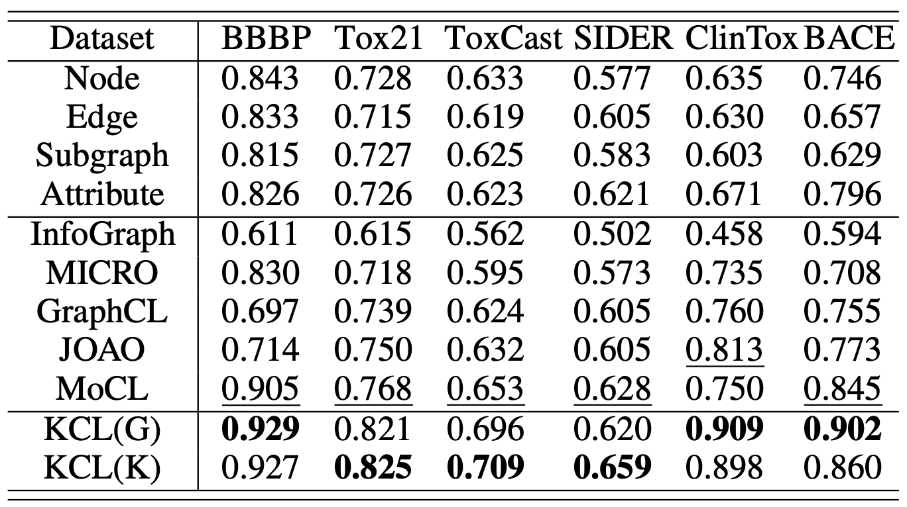

[**中文**](https://github.com/ZJU-Fangyin/KCL/blob/main/README_CN.md) | [**English**](https://github.com/ZJU-Fangyin/KCL/blob/main/README.md)


[](https://github.com/Fangyin1994/KCL/blob/main/LICENSE)
[](https://arxiv.org/abs/2112.00544)

<p align="center">
  	<font size=12><strong>化学元素知识图谱指导下的分子图对比学习</strong></font>
</p>

这是针对我们论文 [**Molecular Contrastive Learning with Chemical Element Knowledge Graph**](https://arxiv.org/abs/2112.00544)的官方简介，目前论文已被 **AAAI 2022** 主会录用。
```
Yin Fang, Qiang Zhang, Haihong Yang, Xiang Zhuang, Shumin Deng, Wen Zhang, Ming Qin, Zhuo Chen, Xiaohui Fan and Huajun Chen. Molecular Contrastive Learning with Chemical Element Knowledge Graph. AAAI2022 main track. (CCF A). 
```


# 项目成员
方尹、张强、杨海宏、庄祥、邓淑敏、张文、秦铭、陈卓、范骁辉、陈华钧。


# 项目简介
一种知识增强的分子图对比学习框架Knowledge-enhanced Contrastive Learning (KCL)。利用化学元素知识图谱指导原始分子图的增强过程，并针对分子增强图设计了知识感知的消息传递网络KMPNN，通过最大化正样本对之间的一致性和硬负样本对之间的差异性构建对比损失以优化模型。
<div align=center>
</div>

# 环境要求
您需要按以下要求配置项目运行环境：
```
python         3.7
torch          1.7.1
dgl            0.6.1
rdkit          2018.09.3
dgllife        0.2.8
pandarallel    1.5.2
numpy          1.20.3
pandas         1.3.1
lmdb           1.2.1
```

# 数据准备
请`cd data`并运行以下命令来进行数据准备：
- `python graph_utils.py`
若您需要使用硬负样本挖掘，请`cd data`并运行以下命令：
- `bash dist.sh`
- `bash cluster.sh`
- `python uni_cluster.py`

# 运行代码
请`cd kcl`运行以下命令来预训练项目模型：
- `bash script/pretrain.sh`

# 评估效果
请运行以下命令来评估项目模型的效果：
- `bash script/finetune.sh`
您可以通过替换`data_name`参数以更换不同的数据集。

# 预训练项目模型
您也可以根据以下路径下载预训练好的项目模型：
`/dump/Pretrain/gnn-kmpnn-model`

# 结果
为了验证KCL的效果，我们在MoleculeNet的8个基准数据集上进行评测。我们分别在fine-tune protocol和linear protocol两种设定下进行了实验。实验表明，KCL在两种设定下均比以往分子图表示学习方法效果更佳。
* fine-tune protocol效果
<div align=center>
</div>


* linear protocol效果
<div align=center>
</div>

# 如何引用
如果您使用或拓展我们的工作，请引用以下论文：

```

```
