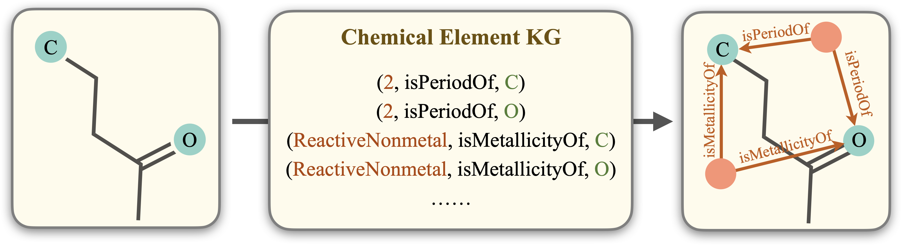
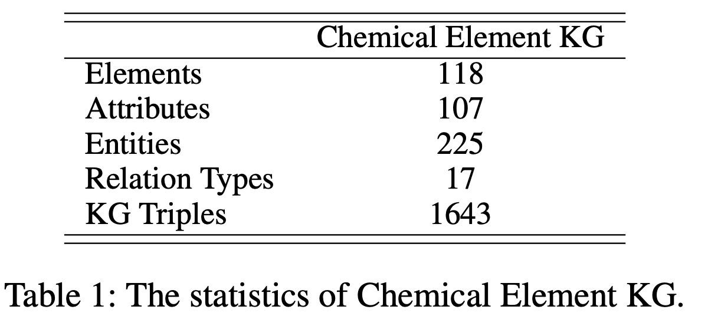
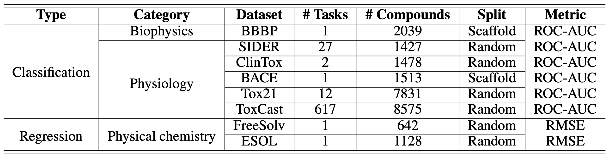

[**中文**](https://github.com/ZJU-Fangyin/KCL/blob/main/README_CN.md) | [**English**](https://github.com/ZJU-Fangyin/KCL/blob/main/README.md)

<p align="center">
  	<font size=6><strong>化学元素知识图谱指导下的分子图对比学习</strong></font>
</p>

这是针对我们论文 [**Molecular Contrastive Learning with Chemical Element Knowledge Graph**](https://arxiv.org/abs/2112.00544)的官方简介，目前论文已被 **AAAI 2022** 主会录用。
```
Yin Fang, Qiang Zhang, Haihong Yang, Xiang Zhuang, Shumin Deng, Wen Zhang, Ming Qin, Zhuo Chen, Xiaohui Fan and Huajun Chen. Molecular Contrastive Learning with Chemical Element Knowledge Graph. AAAI2022 main track. (CCF A). 
```


# 作者
方尹、张强、杨海宏、庄祥、邓淑敏、张文、秦铭、陈卓、范骁辉、陈华钧。


# 论文介绍
一种知识增强的分子图对比学习框架Knowledge-enhanced Contrastive Learning (KCL)。利用化学元素知识图谱指导原始分子图的增强过程，并针对分子增强图设计了知识感知的消息传递网络KMPNN，通过最大化正样本对之间的一致性和硬负样本对之间的差异性构建对比损失以优化模型。
<div align=center>
</div>

## 摘要

## 模型
具体来说，KCL框架分为三个模块，如下图所示：
<div align=center>
</div>

### (1) Knowledge-guided Graph Augmentation

知识指导的图增强模块利用化学元素知识图谱指导原始分子图的增强过程，使分子增强图不仅包含拓扑结构知识，还包含元素的基本领域知识。

* Chemical Element KG Construction：我们从化学元素周期表中获取所有化学元素及其基本化学性质。每个元素具有15个以上的性质，包括金属性、周期性、状态、重量、电负性、电子亲和力、熔点、沸点、电离、半径、硬度、模量、密度、导电、热量和丰度。提取出的三元组以 (Gas, isStateOf, Cl)的形式存在于KG中，代表元素和性质之间存在指定的关系。

<div align=center>
</div>


## 实验
### (1) 数据集
为了验证KCL的效果，我们在MoleculeNet的8个基准数据集上进行评测，数据集具体信息如下所示：
<div align=center>
</div>

### (2) 实验结果
我们分别在fine-tune protocol和linear protocol两种设定下进行了实验。实验表明，KCL在两种设定下均比以往分子图表示学习方法效果更佳。

* fine-tune protocol效果
<div align=center>
</div>

* linear protocol效果
<div align=center>
</div>

# 如何引用
如果您使用或扩展我们的工作，请引用以下文章：

```

```
